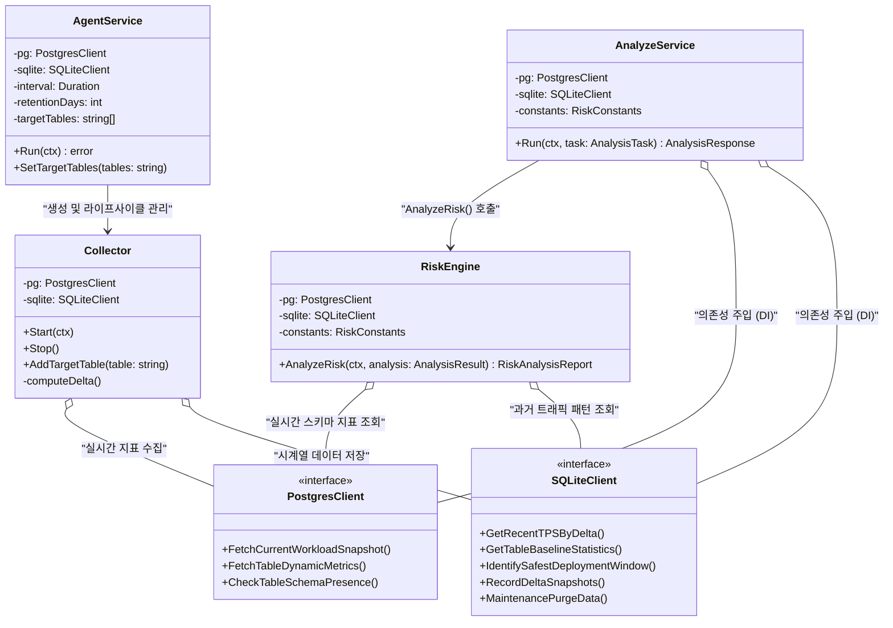

# 🏗️ 클래스 다이어그램 (Class & Interface Diagram)

본 다이어그램은 MigraGuard의 정적 구조를 나타내며, 인터페이스 기반의 의존성 주입(Dependency Injection)과 각 서비스의 책임(Responsibility)을 명확히 정의합니다.

## 1. 설계 의도
- **결합도 감소(Decoupling)**: 모든 서비스는 구체적인 구현체가 아닌 인터페이스(`PostgresClient`, `SQLiteClient`)에 의존하여 유연성을 확보했습니다.
- **역할 분리(SoC)**: 분석(`AnalyzeService`), 수집(`AgentService`), 리스크 산출(`RiskEngine`)의 책임을 분리하여 관리 효율성을 높였습니다.

## 2. 다이어그램 (Mermaid)

## 3. 핵심 구성 요소 설명
| 구성 요소 | 설명 |
| :--- | :--- |
| **AnalyzeService** | 사용자의 DDL 분석 요청을 총괄하며 전체 파이프라인(파싱->검증->분석)을 실행함. |
| **AgentService** | 백그라운드 지표 수집 프로세스의 라이프사이클(시작/종료)을 관리함. |
| **RiskEngine** | 5단계 정밀 리스크 모델을 탑재하여 수집된 지표를 기반으로 위험도를 수치화함. |
| **PostgresClient** | 운영 DB(Postgres)의 실시간 통계 뷰에 접근하는 인터페이스. |
| **SQLiteClient** | 수집된 메트릭을 저장하고 과거 패턴을 조회하는 로컬 저장소 인터페이스. |
