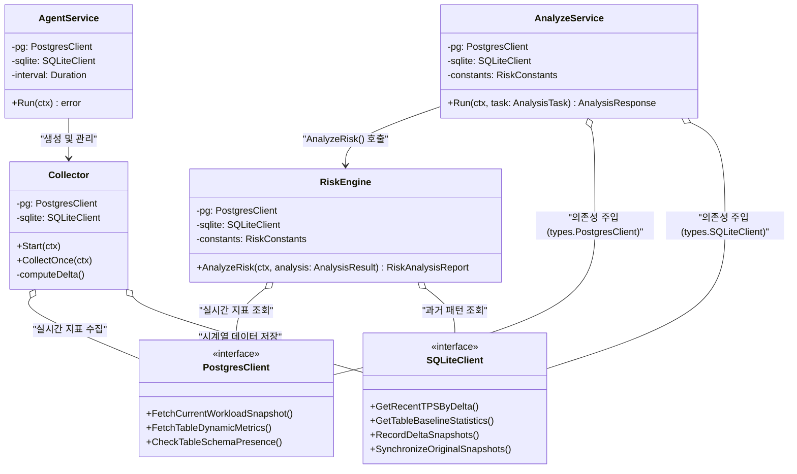

# 🏗️ 클래스 다이어그램 (Class & Interface Diagram)

본 다이어그램은 MigraGuard의 기능 중심 정적 구조를 나타내며, 인터페이스 기반의 의존성 주입(DI) 관계를 정의합니다.

## 1. 설계 의도
- **기능 기반 응집**: `analyzer`, `collector` 등 도메인별로 명확히 분리된 구조를 시각화합니다.
- **인터페이스 기반 설계**: `types` 패키지에 정의된 인터페이스를 통해 인프라와 도메인을 분리했습니다.

## 2. 다이어그램 (Mermaid)

## 3. 핵심 패키지 설명
| 패키지 | 위치 | 역할 |
| :--- | :--- | :--- |
| **app** | `internal/app` | CLI 명령을 수신하여 실제 도메인 서비스를 구동하는 상위 레이어. |
| **analyzer** | `internal/analyzer` | SQL 파싱 및 리스크 계산 로직이 집약된 핵심 도메인. |
| **collector** | `internal/collector` | 지표 수집 및 델타 계산을 담당하는 백그라운드 워커 도메인. |
| **infra** | `internal/infra` | Postgres 및 SQLite와의 저수준 통신을 담당하는 어댑터 구현체. |
| **shared/types** | `internal/shared/types` | 프로젝트 전체에서 공유하는 데이터 모델 및 인터페이스 정의. |
