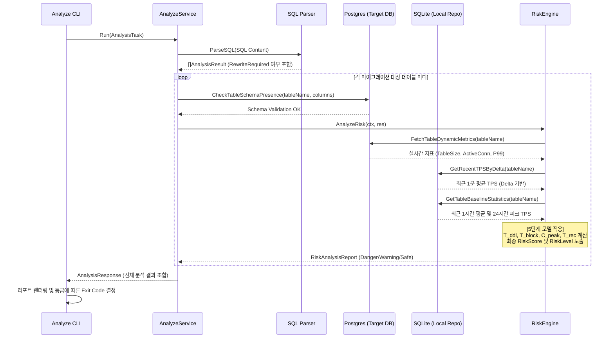

# 🔄 리스크 분석 시퀀스 다이어그램 (Analyze Sequence Diagram)

본 다이어그램은 사용자가 마이그레이션 SQL 분석을 요청했을 때, 시스템 내부에서 발생하는 동적 호출 흐름과 데이터 상호작용을 나타냅니다.

## 1. 설계 의도
- **단계별 검증(Validation)**: SQL 파싱 후 실제 데이터베이스 스키마와 대조하여 분석의 신뢰성을 확보하는 과정을 보여줍니다.
- **데이터 결합(Hybrid Data Loading)**: `RiskEngine`이 실시간 지표(Postgres)와 과거 이력(SQLite)을 어떻게 결합하여 보수적인 리스크를 산출하는지 시각화했습니다.

## 2. 다이어그램 (Mermaid)

## 3. 상세 절차 설명
1.  **Parsing**: `pg_query_go`를 통해 DDL을 AST로 분석하고 테이블 재작성 필요성을 판별합니다.
2.  **Schema Check**: 분석 전 타겟 DB의 스키마와 대조하여 대상 테이블/컬럼이 실제 존재하는지 확인합니다.
3.  **Metrics Gathering**: 
    - **실시간**: Postgres 시스템 뷰에서 현재 커넥션 수와 테이블 크기 등을 조회합니다.
    - **히스토리**: SQLite에서 과거 트래픽 패턴(Delta TPS)을 로드합니다.
4.  **Risk Evaluation**: 수집된 데이터를 5단계 수식에 대입하여 장애 발생 가능성을 예측합니다.
5.  **Output**: 최종 등급이 `Danger`일 경우 CLI는 종료 코드 `1`을 반환하여 배포 파이프라인을 중단시킵니다.
