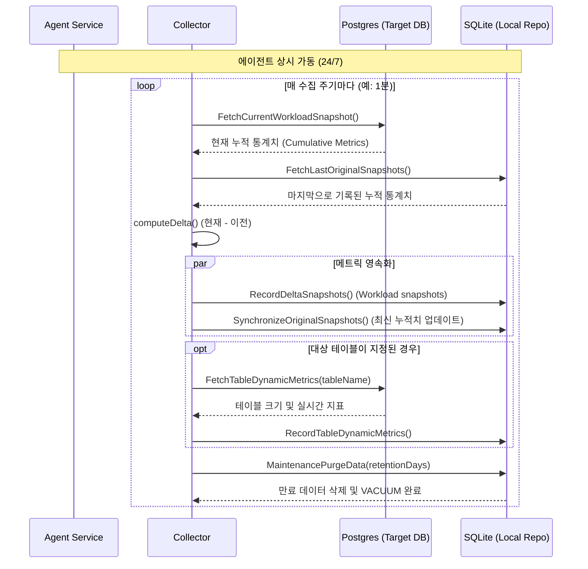

# 📡 지표 수집 시퀀스 다이어그램 (Agent Collection Sequence Diagram)

본 다이어그램은 백그라운드에서 실행되는 에이전트가 운영 데이터베이스의 지표를 어떻게 수집하고 델타(Delta) 값을 계산하여 영속화하는지를 나타냅니다.

## 1. 설계 의도
- **연속성 보장(Continuity)**: 에이전트 재시작 시에도 누적 지표의 변화량(Delta)을 정확히 계산하기 위해 마지막 누적치를 영속적으로 관리하는 과정을 보여줍니다.
- **자동 최적화**: 지표 수집 시 저장소의 부하를 최소화하고 주기적인 가비지 컬렉션을 수행하는 시스템의 자율성을 강조했습니다.

## 2. 다이어그램 (Mermaid)

## 3. 핵심 로직 설명
- **Delta Computation**: PostgreSQL의 지표는 누적치이므로, 시점별 부하를 파악하기 위해서는 반드시 `(현재 누적치 - 이전 누적치) / 간격` 계산이 필요합니다.
- **SynchronizeOriginalSnapshots**: 에이전트가 재시작되어도 SQLite에 보관된 마지막 누적치를 통해 첫 번째 주기의 델타 값을 정확히 계산할 수 있습니다.
- **Maintenance**: 수집된 데이터가 로컬 디스크 용량을 고갈시키지 않도록 주기적인 데이터 삭제(Purge)를 수행합니다.
