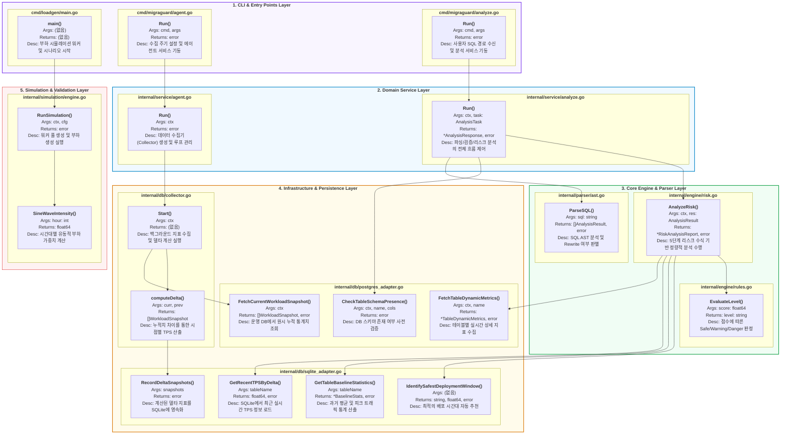

# 🗺️ MigraGuard 계층형 전역 구현 지도 (Layered Full Detail Map)

본 문서는 MigraGuard의 소스 코드 구조를 **5개의 논리적 계층(Layer)**으로 분류하고, 각 계층 내 파일(.go)과 함수의 상세 시그니처 및 역할을 기술한 통합 설계도입니다.

## 1. 설계 의도
- **계층형 아키텍처 시각화**: CLI -> Service -> Core -> Infra로 이어지는 계층 구조를 명확히 함.
- **정보의 밀집 및 조직화**: 파일 단위의 상세 정보를 유지하면서도, 대단위 컴포넌트 간의 관계를 체계화함.
- **공학적 완성도**: 캡스톤 디자인 심사 시 시스템의 모듈화 및 계층 분리 설계를 증명하는 용도로 최적화함.

## 2. 계층형 전역 구현 지도 (Mermaid)

## 3. 계층별 책임 및 데이터 흐름 요약

| 계층 (Layer) | 주요 역할 | 핵심 데이터 흐름 |
| :--- | :--- | :--- |
| **CLI Layer** | 사용자 인터페이스 제공 및 명령 전달 | CLI Flag/Args -> Service Task |
| **Service Layer** | 비즈니스 로직 오케스트레이션 | Task -> Engine 호출 -> Report 생성 |
| **Core Layer** | SQL 분석 및 리스크 산출 알고리즘 수행 | SQL String -> AST -> Risk Score |
| **Infra Layer** | 데이터베이스 접근 및 시계열 지표 관리 | Postgres Stat -> Delta Calculation -> SQLite |
| **Simulation Layer** | 시스템 검증을 위한 인위적 부하 발생 | Time Config -> Sine Curve -> DB Transaction |

---
*Last Updated: 2026-04-14 (Layered Full Detail Map Finalized)*
