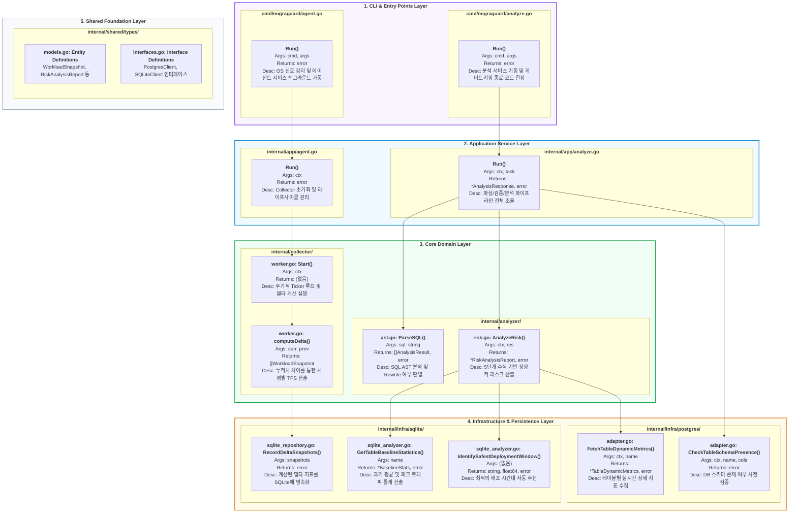

# 🗺️ MigraGuard 계층형 전역 구현 지도 (Layered Full Detail Map)

본 문서는 MigraGuard의 **기능 중심 아키텍처(v3.6)**를 기반으로, 각 레이어별 파일 경로와 함수의 상세 시그니처를 기술한 통합 설계도입니다.

## 1. 설계 의도
- **구조 개편 반영**: `analyzer`, `collector`, `infra`, `app`, `shared`로 재편된 최신 디렉토리 구조를 완벽히 시각화함.
- **추적성 극대화**: 상위 어플리케이션 레이어부터 하위 인프라 레이어까지의 호출 경로를 파일 단위로 명시함.

## 2. 계층형 전역 구현 지도 (Mermaid)

## 3. 기능 중심 레이어별 책임 요약

| 레이어 (Layer) | 주요 파일 위치 | 핵심 책임 |
| :--- | :--- | :--- |
| **CLI & Entry** | `cmd/` | 사용자 인터페이스 제공 및 OS 신호 처리. |
| **Application** | `internal/app` | 유스케이스 조율 및 도메인 로직 실행 흐름 제어. |
| **Domain** | `internal/analyzer`, `internal/collector` | 시스템의 핵심 비즈니스 로직 및 알고리즘 수행. |
| **Infrastructure** | `internal/infra` | 데이터베이스 연결 및 외부 라이브러리와의 저수준 상호작용. |
| **Shared** | `internal/shared` | 프로젝트 전역에서 사용하는 데이터 모델, 인터페이스, 에러 규격 보관. |

---
*Last Updated: 2026-04-14 (v3.6 Feature-First Architecture Finalized)*
