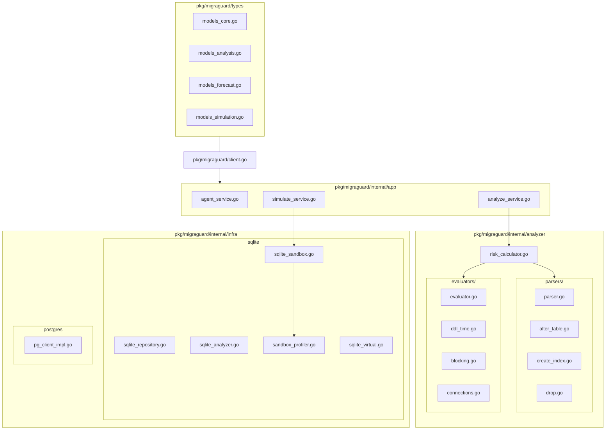

# 🏛️ MigraGuard System Architecture Overview

This document describes the **SDK-First Architecture** of MigraGuard, its data flow, and the design philosophy of the core risk model.

---

## 1. SDK-First Modular Architecture

MigraGuard is designed as a reusable library (SDK) that can be embedded into various interfaces such as CLI tools, MCP servers, or CI/CD pipelines. Through v3.9 refactoring, domains have been highly decoupled, and the 5-step risk evaluators and AST SQL parsers have been successfully separated into dedicated subpackages.

### 1.1. Core Architectural UML Package Diagram

### 1.2. Core Package Structure
- **`pkg/migraguard` (Entry)**: The public entry point. Provides the `Client` with Factory Methods (`NewLiveClient`, `NewSandboxClient`) for explicit environment separation.
- **`pkg/migraguard/types` (Models)**: Domain models are deconstructed into 4 distinct, purpose-driven files (`models_core.go`, `models_analysis.go`, `models_forecast.go`, `models_simulation.go`) to strictly enforce the Single Responsibility Principle (SRP).
- **`pkg/migraguard/internal` (Private Core)**: Encapsulated domain logic:
    - **Analyzer**: Modular risk assessment using the **Strategy Pattern** is enhanced by isolating the 5-step risk assessment engines (inside `evaluators/` package) and SQL AST extractors (inside `parsers/` package).
    - **Collector**: Background metric harvesting via `metric_collector.go` with robust multi-dimensional exception safety via `rows.Err()` validations.
    - **Infra**: Database adapters for PostgreSQL and SQLite with consistent **Context Propagation**, supporting offline workload simulations via `VirtualPGAdapter`.
    - **Shared**: Standardized **Error Coding System** (`MG-XXX-###`).

### 1.3. Architecture Layers
1. **Interface Layer**: CLI (`cmd/`), MCP Server, or API.
2. **SDK Layer**: High-level `Client` API with full Dependency Injection (DI) and structured logger (`types.Logger`) integration.
3. **Domain Layer**: Orchestrated via `internal/app` (Service Layer Pattern).
4. **Adapter Layer**: Logic-less database drivers and simulation virtualization (`VirtualPGAdapter`).

---

## 2. Flexible Configuration System

MigraGuard uses a hierarchical configuration system (YAML > Env Vars > Defaults).

| Component | Setting File | Default Location |
| :--- | :--- | :--- |
| **Main Config** | `migraguard.yaml` | Current directory or `/etc/migraguard/` |
| **Overrides** | `.env` | Environment variables prefixed with `MIGRAGUARD_` |

---

## 3. 5-Step Quantitative Risk Model

MigraGuard calculates the final risk score through 5 systematic stages based on operational data:

1.  **Step 1: $T_{ddl}$ (Schema Analysis)**: Predicts execution time based on DDL type and table size. (Evaluated inside `evaluators/ddl_time.go`)
2.  **Step 2: $T_{block}$ (Lock Contention)**: Calculates the potential blocking window by summing DDL time, P99 latency, and replication lag. (Evaluated inside `evaluators/blocking.go`)
3.  **Step 3: $C_{peak}$ (Peak Concurrency)**: Forecasts the maximum connection surge during the blocking window. (Evaluated inside `evaluators/connections.go`)
4.  **Step 4: $T_{rec}$ (Recovery Cost)**: Evaluates the time required for system normalization after the lock release. (Evaluated inside `evaluators/recovery.go`)
5.  **Step 5: Risk Classification**: Assigns Safe / Warning / Danger levels based on system capacity thresholds ($C_{max}, \mu_{max}$). (Evaluated inside `evaluators/scoring.go`)

---

## 4. Research Workspace

The `experiments/` directory provides a structured environment for offline validation:
- `scenarios/`: YAML-based declarative load profiles. (Featuring v3.9-expanded 20 realistic offline scenarios)
- `ddl/`: Research-specific migration SQL cases.
- `data/`: Persistence layer for generated SQLite sandboxes.
