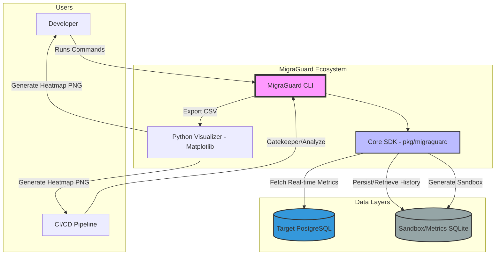

# Level 0: System Context Diagram

This diagram provides a high-level overview of how **MigraGuard** interacts with external actors and system components during the database migration lifecycle.

### Key Interactions
1.  **Developer/Pipeline**: Initiates the process via CLI (e.g., `analyze`, `simulate`).
2.  **CLI & SDK**: The CLI acts as a wrapper for the Core SDK, which contains the mathematical risk engine.
3.  **Data Persistence**: Real-time metrics are harvested from PostgreSQL, while historical trends and simulation data are stored in SQLite.
4.  **Visualization**: Python scripts are used as a downstream consumer of the analysis data to produce high-fidelity reports.
