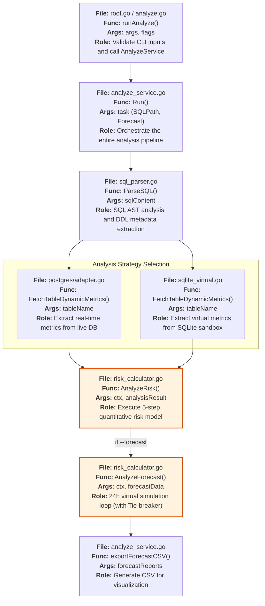
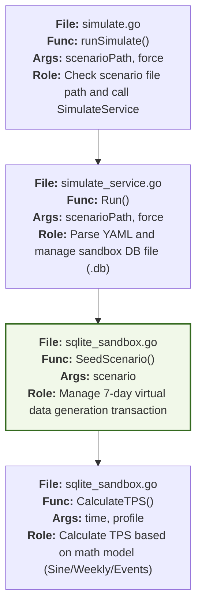
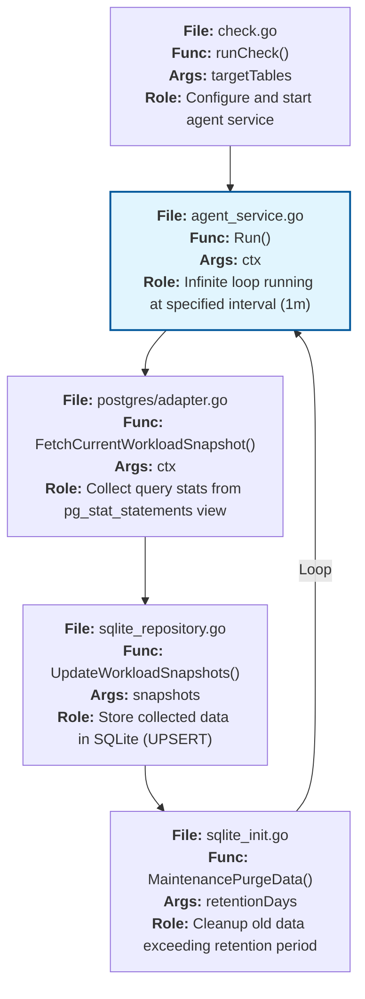
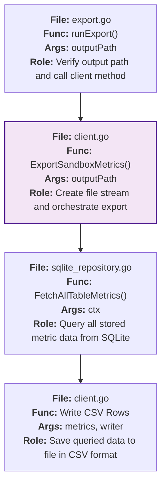

# Level 1: CLI Command Implementation Flows

This document visualizes the execution paths for all CLI commands supported by MigraGuard. Each node includes the actual implementation file and function info.

---

## 1. `analyze` Command (Live / Sandbox / Forecast)
Analyzes the risk of a user's DDL and predicts future traffic.

---

## 2. `simulate` Command (Sandbox Generation)
Generates virtual traffic scenarios to build a research environment.

---

## 3. `check` Command (Background Agent)
Continuously collects live DB metrics and stores them in SQLite.

---

## 4. `export` Command (Data Extraction)
Exports collected or generated sandbox data to research-grade CSV.

