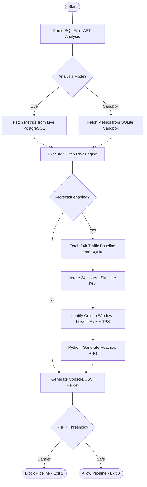
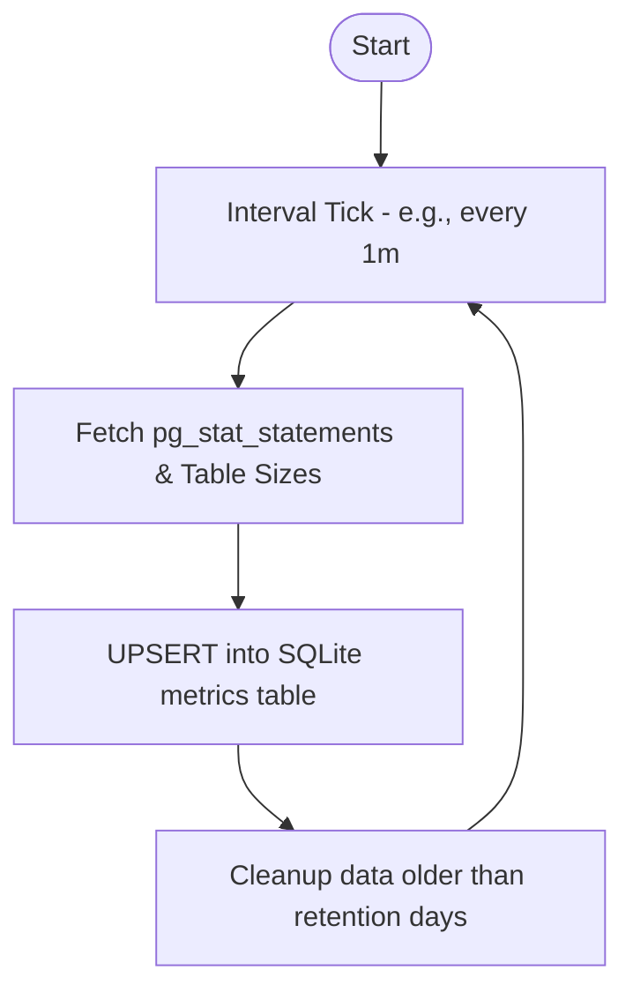

# Level 1: Command-Level Workflows

This document details the operational flow for each primary MigraGuard command.

## 1. `analyze` Workflow (Risk Assessment & Forecast)

The `analyze` command is the core "Circuit Breaker" of the system.



## 2. `simulate` Workflow (Research Sandbox Generation)

Allows researchers to create controlled environments via declarative YAML.

```mermaid
flowchart TD
    Start([Start]) --> YAML[Read Scenario YAML]
    YAML --> Prof[Initialize Workload Profiler]
    Prof --> DB[Create fresh {Experiment}.db]
    DB --> Seed[Seed 7-day History with Sine/Noise Patterns]
    Seed --> Finish([Sandbox Ready])
```

## 3. `agent` Workflow (Background Collection)

Ensures the system has enough historical data for predictive forecasting.


