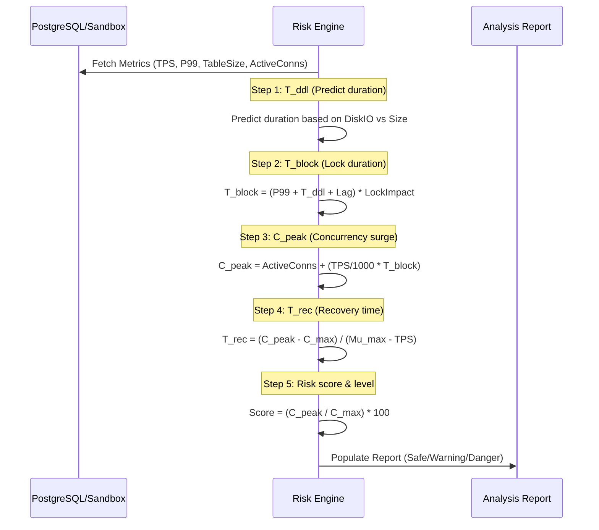
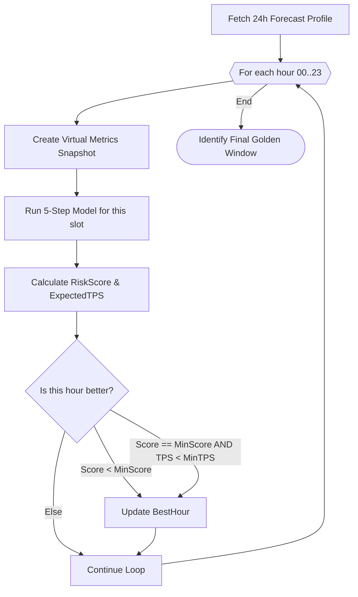

# Level 2: Component Deep-Dives

This document explores the internal logic of the Risk Engine and the Golden Window discovery algorithm.

## 1. The 5-Step Quantitative Risk Model

Each DDL is evaluated through five systematic stages to calculate the final risk score.

## 2. Golden Window Discovery (Predictive Forecast)

When `--forecast` is enabled, the engine performs 24 virtual simulations to find the safest time for deployment.

### The TPS Tie-Breaker Logic (v3.8 Improvement)
If multiple hours are deemed equally "Safe" by the risk engine (e.g., they all hit the *Base Risk* floor of 30.0), the engine selects the hour with the **lowest Expected TPS**. This ensures the deployment is scheduled during the period of absolute minimum physical traffic, maximizing the safety margin.
