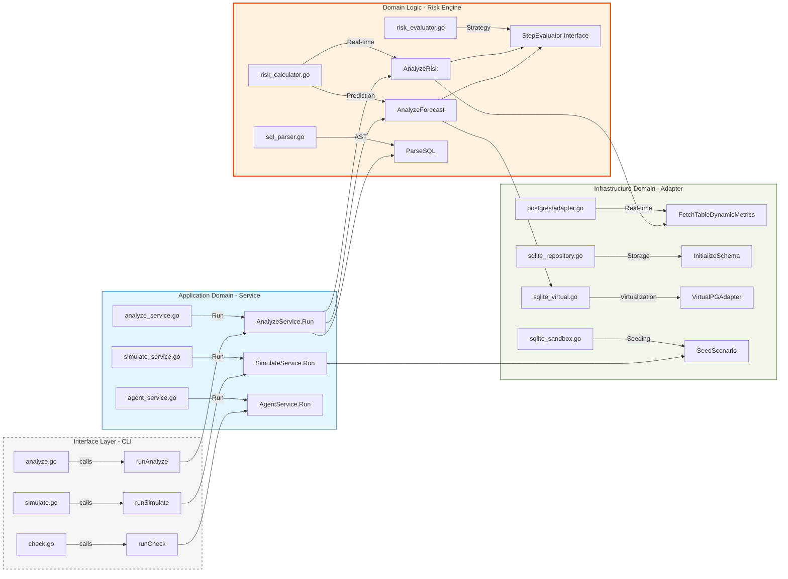

# Level 3: Visual Implementation Traceability Map

This diagram provides a direct visual link between the architectural domains and the specific Go files and functions that implement them.

### Traceability Highlights
*   **Analysis Stream**: `analyze.go` (CLI) $\rightarrow$ `analyze_service.go` (Orchestration) $\rightarrow$ `risk_calculator.go` (Core Math).
*   **Mathematical Execution**: The `AnalyzeRisk` and `AnalyzeForecast` functions in `risk_calculator.go` act as the brain, calling individual `StepEvaluator` strategies in `risk_evaluator.go`.
*   **Simulation Stream**: `simulate.go` (CLI) $\rightarrow$ `simulate_service.go` (Orchestration) $\rightarrow$ `sqlite_sandbox.go` (Data Generation).
*   **Virtualization**: When in sandbox mode, the `AnalyzeForecast` logic switches from the real `postgres/adapter.go` to the `sqlite_virtual.go` adapter to avoid touching production databases.
