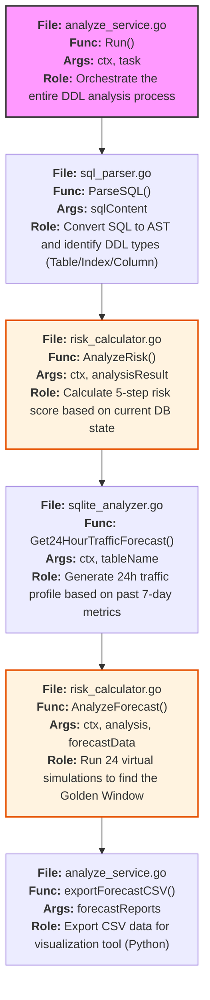
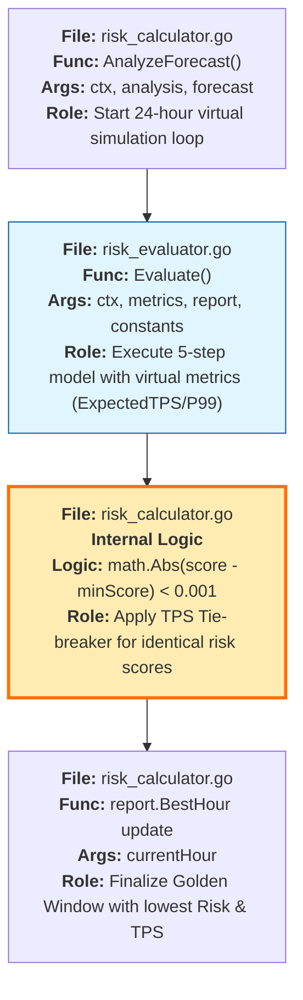
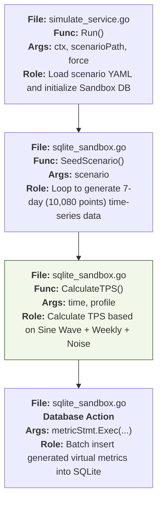

# Level 4: Function-Level Micro-Flows (Rich Implementation Nodes)

This diagram details MigraGuard's core logic at the function level, describing exactly which file and function perform each step with what arguments.

---

## 1. `analyze` Command Execution Logic (Analyze Pipeline)

---

## 2. Predictive Engine Internal Logic (Forecast & Tie-Breaker)

---

## 3. Sandbox Data Generation Logic (Sandbox Seeding)

