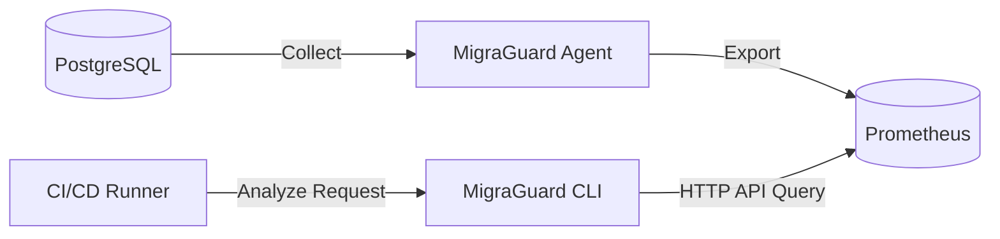

# 🏛️ Architectural Refinement: Future Research & Development Roadmap

This document serves as the technical blueprint for the **"Future Work"** section of the graduation thesis and capstone design. It outlines 4 core high-level refinement plans to overcome the practical limitations of the v3.8 prototype and integrate seamlessly into enterprise DevSecOps pipelines.

---

## 1. 🌐 Roadmap 1: TSDB Integration & HTTP API Architecture for Segregated Networks

### 1.1. Current Architectural Bottlenecks
- The current agent ([agent_service.go](file:///home/gyeongho/Github/MigraGuard/cmd/migraguard/agent_service.go)) writes metrics locally to a SQLite file.
- This creates physical file system barriers (network segregation) for CI/CD runners (like GitHub Actions) operating in remote containers, which cannot access the local host disk of isolated production database servers.

### 1.2. Future Enhancements
- **Prometheus & OpenTelemetry Export:** Instead of maintaining a standalone local SQLite database, the agent will PUSH metrics directly to industry-standard time-series databases (TSDBs) like Prometheus, InfluxDB, or VictoriaMetrics.
- **HTTP API-driven Analyzer:** The CLI analyzer will be abstracted to query recent 24-hour TPS and P99 latency trends via HTTP API endpoints against the centralized monitoring server rather than taking a local SQLite file path flag.

---

## 2. 🤖 Roadmap 2: Machine Learning-based Risk Model Calibration

### 2.1. Current Architectural Bottlenecks
- The risk scoring and duration forecasting formulas ([risk_evaluator.go](file:///home/gyeongho/Github/MigraGuard/pkg/migraguard/internal/analyzer/risk_evaluator.go)) rely on statically declared magic numbers (such as arbitrary multipliers).
- This static configuration cannot adapt to the non-linear, complex performance bottlenecks of real-world database hardware environments.

### 2.2. Future Enhancements
- **Query Statistics Training Pipeline:** Establish a continuous learning pipeline that harvests `pg_stat_statements` views and OS-level resources, feeding them into a regression or light machine learning model (e.g., XGBoost) to map the correlation between DDL duration and background traffic levels.
- **Adaptive Parameter Auto-Extraction:** Complete the adaptive recommendation engine (`feat/adaptive-recommendation`), which eliminates manual specification of hardware limits ($\mu_{max}$, $DiskIO$) by letting the system dynamically train on past workloads to calculate and calibrate optimal thresholds.

---

## 3. 🛠️ Roadmap 3: Automated Online Schema Change Prescriptions

### 3.1. Current Architectural Bottlenecks
- For DDLs classified as "Danger", the tool simply blocks the deployment pipeline and suggests a scheduling change (Golden Window), acting as a strict blocker that slows down the developer release velocity.

### 3.2. Future Enhancements
- **Automated Prescription Scripts:** Beyond mere blocking, analyze table sizes and current locks to automatically generate execution scripts for online, lock-free migration tools like `gh-ost` or `pt-online-schema-change`.
- **Adaptive Throttling Advice:** Dynamically compute and inject parameters based on real-time replication lag (e.g., recommending `--max-lag-s=2` under active transactional pressure) to guarantee safe無잠금 migrations.

---

## 4. 🔒 Roadmap 4: Least Privilege & Security Audit Trail for Production DBs

### 4.1. Current Architectural Bottlenecks
- The account privileges required for the agent to access production databases are vague, and there is no built-in audit trail recording the agent's internal scans, which hinders passing strict enterprise security reviews.

### 4.2. Future Enhancements
- **Least Privilege Read-Only Role Template:** Officially bundle a read-only PostgreSQL role template in the deployment spec, guaranteeing zero access to user-table DML/DCL while allowing access only to metadata views (`pg_catalog` and `pg_stat_statements`).
- **Agent Audit Trail Logging:** Implement an internal audit logging framework where the agent self-records all queries and scan ranges to audit activities and ensure they do not cause accidental lock escalations or memory starvation.
