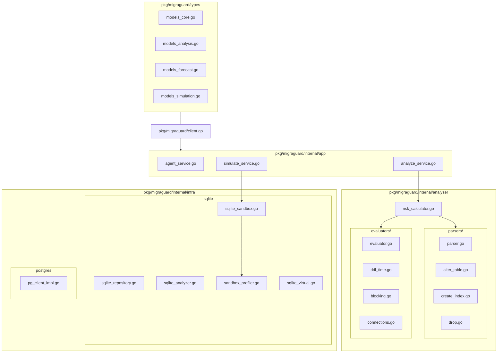

# 🏛️ MigraGuard 시스템 아키텍처 개요

본 문서는 MigraGuard의 **SDK-First 아키텍처**, 데이터 흐름, 그리고 핵심 리스크 모델의 설계 철학을 상세히 기술합니다.

---

## 1. SDK-First 모듈형 아키텍처

MigraGuard는 CLI 도구, MCP 서버, CI/CD 파이프라인 등 다양한 인터페이스에 통합될 수 있도록 재사용 가능한 라이브러리(SDK) 형태로 설계되었습니다. v3.9 리팩토링을 통해 도메인간 결합도를 극도로 낮추고, 5대 평가기와 파서를 각각 전용 서브 패키지로 격리 완수했습니다.

### 1.1. 핵심 아키텍처 UML 패키지 다이어그램

### 1.2. 핵심 패키지 구조
- **`pkg/migraguard` (Entry)**: 모든 기능의 공개 진입점입니다. `NewLiveClient`, `NewSandboxClient`와 같은 팩토리 메소드를 통해 환경별 클라이언트를 제공합니다.
- **`pkg/migraguard/types` (Models)**: 핵심 비즈니스 도메인별로 4분할 기법(`models_core.go`, `models_analysis.go`, `models_forecast.go`, `models_simulation.go`)을 적용하여 SRP(단일 책임 원칙)를 엄수했습니다.
- **`pkg/migraguard/internal` (Private Core)**: 캡슐화된 핵심 도메인 로직입니다.
    - **Analyzer**: **전략 패턴(Strategy Pattern)**을 고도화하여 5대 리스크 평가 모듈(`evaluators/` 패키지)과 DDL AST 추출기(`parsers/` 패키지)를 완벽 분리했습니다.
    - **Collector**: 백그라운드 메트릭 수집을 담당하는 `metric_collector.go`가 포함되어 있으며 데이터 정합성 보장을 위해 `rows.Err()` 다차원 안전 가드를 탑재했습니다.
    - **Infra**: PostgreSQL 및 SQLite와의 물리/가상 통신을 담당하며, `VirtualPGAdapter`를 통해 모의 시뮬레이션 데이터를 안전하게 흐르게 제어합니다.
    - **Shared**: 시스템 전반의 **표준화된 에러 코드 체계**(`MG-XXX-###`)를 정의합니다.

### 1.3. 아키텍처 계층 구조
1.  **Interface Layer**: CLI (`cmd/`), MCP 서버 등 사용자 접점.
2.  **SDK Layer**: 의존성 주입(DI) 및 구조화된 로거(`types.Logger`) 연계를 완벽 지원하는 고수준 `Client` API.
3.  **Domain Layer**: 서비스 레이어 패턴(`internal/app`)을 통한 비즈니스 오케스트레이션.
4.  **Adapter Layer**: 물리 DB 통신 및 시뮬레이션 가상화(`VirtualPGAdapter`).

---

## 2. 유연한 설정 시스템 (Hierarchical Configuration)

MigraGuard는 YAML 파일, 환경 변수, 그리고 기본값 순의 계층형 설정 시스템을 사용합니다.

| 컴포넌트 | 설정 파일 | 기본 경로 |
| :--- | :--- | :--- |
| **메인 설정** | `migraguard.yaml` | 현재 디렉토리 또는 `/etc/migraguard/` |
| **재정의(Override)** | `.env` | `MIGRAGUARD_` 접두사를 가진 환경 변수 |

---

## 3. 5단계 정밀 리스크 모델 (5-Step Risk Model)

연구 및 실무 데이터에 기반하여 다음 5단계를 거쳐 정량적 리스크 점수를 산출합니다.

1.  **Step 1: $T_{ddl}$ (스키마 분석)**: DDL 유형과 테이블 크기를 바탕으로 예상 실행 시간을 예측합니다. (`evaluators/ddl_time.go` 담당)
2.  **Step 3: $T_{block}$ (락 경합)**: DDL 시간, P99 지연 시간, 복제 지연을 합산하여 잠재적 블로킹 윈도우를 계산합니다. (`evaluators/blocking.go` 담당)
3.  **Step 3: $C_{peak}$ (피크 동시성)**: 블로킹 기간 동안 유입될 최대 신규 커넥션 수를 예측합니다. (`evaluators/connections.go` 담당)
4.  **Step 4: $T_{rec}$ (회복 비용)**: 락 해제 후 적체된 요청을 처리하고 시스템이 정상화되는 시간을 평가합니다. (`evaluators/recovery.go` 담당)
5.  **Step 5: 리스크 등급 판정**: 설정된 임계값($C_{max}, \mu_{max}$)을 기준으로 Safe / Warning / Danger 레벨을 부여합니다. (`evaluators/scoring.go` 담당)

---

## 4. 연구용 워크스페이스 (Research Workspace)

`experiments/` 디렉토리는 오프라인 연구를 위한 구조화된 환경을 제공합니다.
- `scenarios/`: YAML 기반의 선언적 로드 프로필. (v3.9 확장 완료된 B2C, B2B, IoT 등 20종 시나리오 풀 내장)
- `ddl/`: 연구용 마이그레이션 SQL 케이스.
- `data/`: 생성된 SQLite 샌드박스 데이터 보관소.
