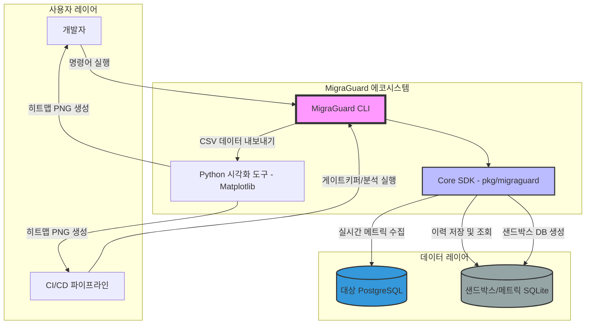

# Level 0: 시스템 컨텍스트 다이어그램 (System Context)

이 다이어그램은 데이터베이스 마이그레이션 라이프사이클 동안 **MigraGuard**가 외부 액터 및 시스템 컴포넌트와 어떻게 상호작용하는지에 대한 고수준 조감도를 제공합니다.

### 주요 상호작용
1.  **개발자/파이프라인**: CLI를 통해 프로세스를 시작합니다 (예: `analyze`, `simulate`).
2.  **CLI & SDK**: CLI는 수학적 리스크 엔진을 포함하고 있는 Core SDK의 래퍼(Wrapper) 역할을 합니다.
3.  **데이터 지속성**: 실시간 메트릭은 PostgreSQL에서 수집되며, 과거 트렌드 및 시뮬레이션 데이터는 SQLite에 저장됩니다.
4.  **시각화**: Python 스크립트는 분석 데이터를 소비하여 고해상도 리포트를 생성하는 다운스트림 역할을 수행합니다.
