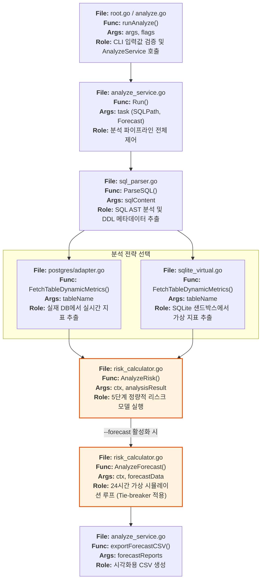
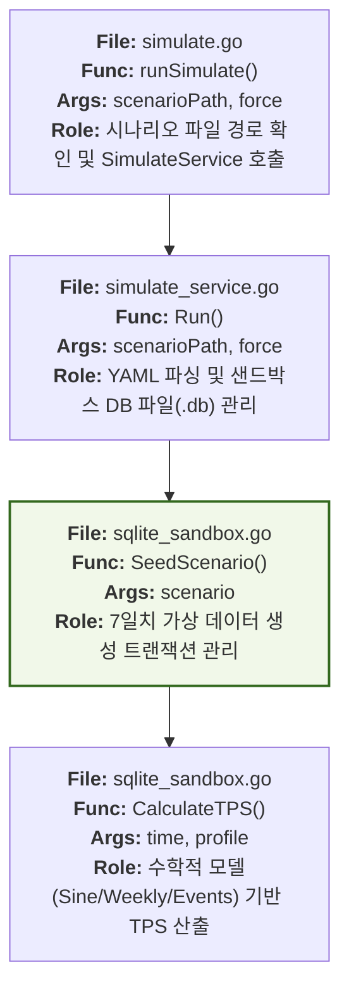
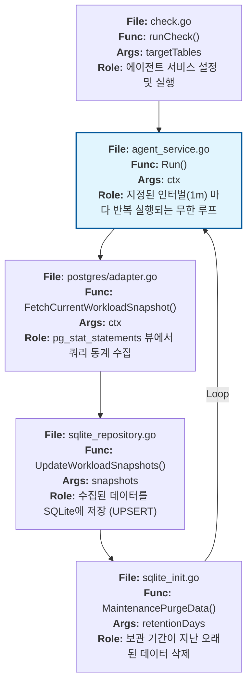
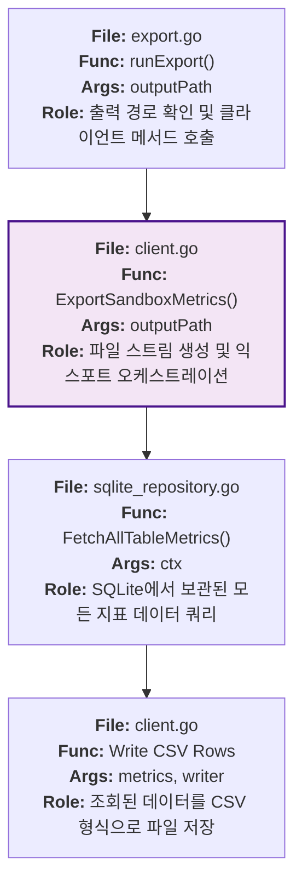

# Level 1: CLI 명령어 구현 흐름 (Implementation Flows)

이 문서는 MigraGuard가 지원하는 모든 CLI 명령어의 실행 경로를 함수 단위의 상세 노드로 시각화합니다. 각 노드는 실제 구현 파일과 함수 정보를 포함합니다.

---

## 1. `analyze` 명령어 (실시간 분석 / 샌드박스 / 예측)
사용자의 DDL 위험도를 분석하고 미래 트래픽을 예측하는 핵심 명령어입니다.

---

## 2. `simulate` 명령어 (샌드박스 생성)
가상의 트래픽 시나리오를 생성하여 연구 및 실험 환경을 구축합니다.

---

## 3. `check` 명령어 (백그라운드 에이전트)
운영 DB의 메트릭을 지속적으로 수집하여 SQLite에 저장합니다.

---

## 4. `export` 명령어 (데이터 추출)
수집되거나 생성된 샌드박스 데이터를 연구용 CSV로 추출합니다.

