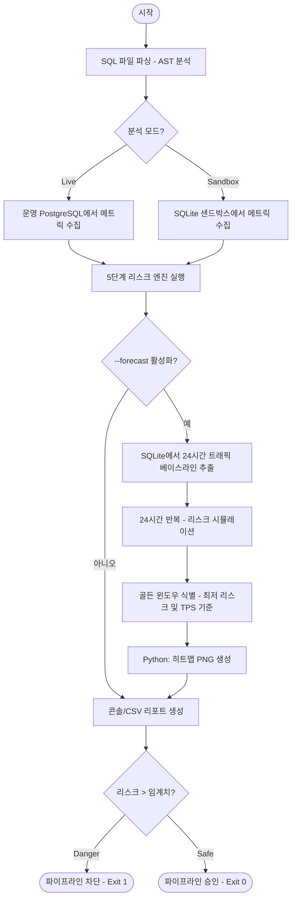
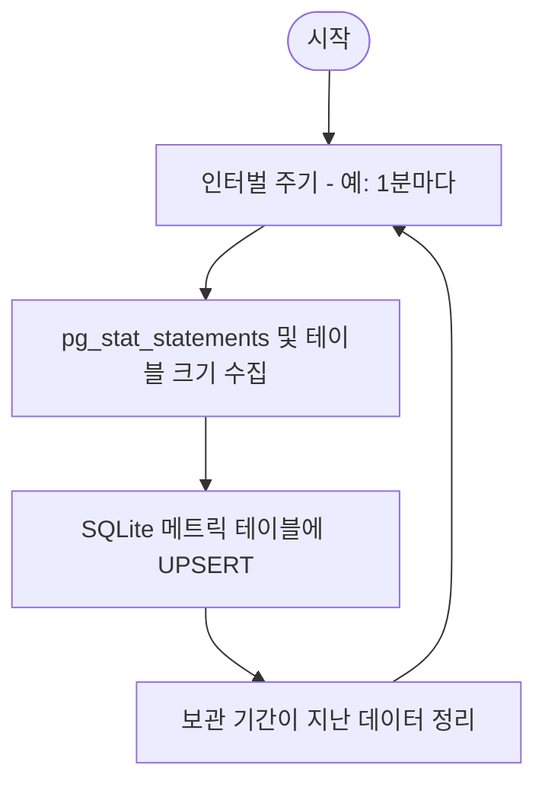

# Level 1: 명령어 단위 워크플로우 (Mid-Level)

이 문서는 주요 MigraGuard 명령어의 운영 흐름을 설명합니다.

## 1. `analyze` 워크플로우 (리스크 평가 및 예측)

`analyze` 명령어는 시스템의 핵심 "서킷 브레이커" 역할을 합니다.



## 2. `simulate` 워크플로우 (연구용 샌드박스 생성)

연구자가 선언적 YAML을 통해 제어된 실험 환경을 구축할 수 있게 합니다.

```mermaid
flowchart TD
    Start([시작]) --> YAML[시나리오 YAML 읽기]
    YAML --> Prof[워크로드 프로파일러 초기화]
    Prof --> DB[새로운 {Experiment}.db 생성]
    DB --> Seed[Sine/Noise 패턴을 가진 7일치 이력 시딩]
    Seed --> Finish([샌드박스 준비 완료])
```

## 3. `agent` 워크플로우 (백그라운드 데이터 수집)

시스템이 예측 분석을 위한 충분한 과거 데이터를 확보하도록 보장합니다.


