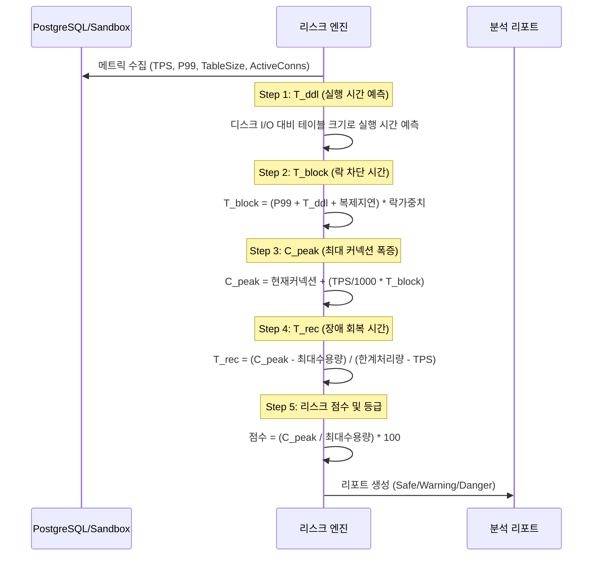
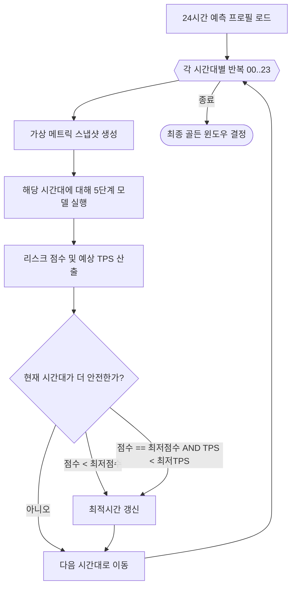

# Level 2: 핵심 컴포넌트 상세 (Deep-Dives)

이 문서는 리스크 엔진의 내부 로직과 골든 윈도우 탐색 알고리즘을 상세히 다룹니다.

## 1. 5단계 정량적 리스크 모델 (5-Step Model)

각 DDL은 최종 리스크 점수를 산출하기 위해 5가지 체계적인 단계를 거쳐 평가됩니다.

## 2. 골든 윈도우 탐색 로직 (Predictive Forecast)

`--forecast` 옵션 사용 시, 엔진은 가장 안전한 배포 시간을 찾기 위해 24번의 가상 시뮬레이션을 수행합니다.

### TPS Tie-Breaker 로직 (v3.8 핵심 개선)
만약 여러 시간대가 동일하게 "안전(Safe)"하다고 판단될 경우(예: 모두 리스크 하한선인 30.0점에 도달), 엔진은 **예상 TPS가 가장 낮은 시간대**를 선택합니다. 이는 물리적인 트래픽이 가장 적은 시점에 작업을 수행하게 함으로써 안전 마진을 극대화합니다.
