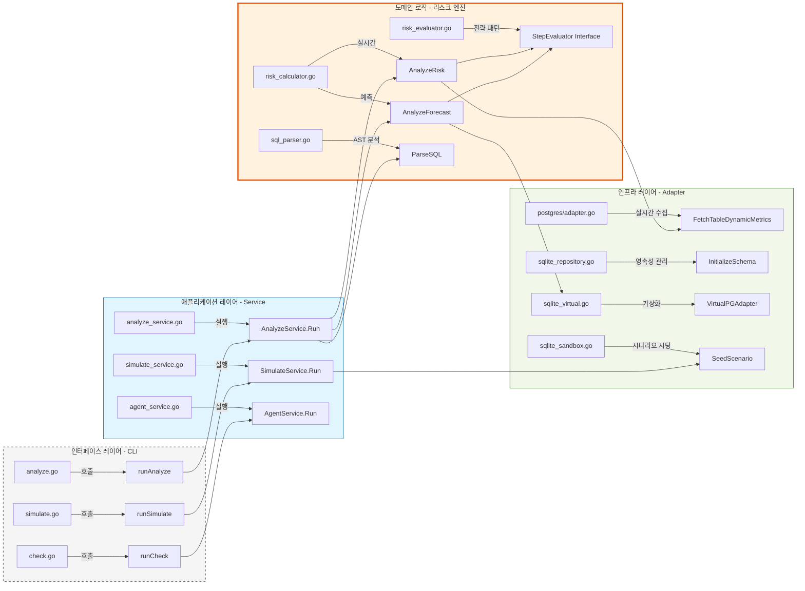

# Level 3: 시각적 구현 추적성 맵 (Traceability Map)

이 다이어그램은 아키텍처 도메인과 이를 구현하는 구체적인 Go 파일 및 함수 간의 직접적인 연결 고리를 제공합니다.

### 추적성 하이라이트
*   **분석 흐름**: `analyze.go` (CLI) $\rightarrow$ `analyze_service.go` (오케스트레이션) $\rightarrow$ `risk_calculator.go` (핵심 수학 모델).
*   **수학적 연산**: `risk_calculator.go`의 `AnalyzeRisk`와 `AnalyzeForecast` 함수가 두뇌 역할을 하며, `risk_evaluator.go`에 정의된 개별 `StepEvaluator` 전략들을 호출합니다.
*   **시뮬레이션 흐름**: `simulate.go` (CLI) $\rightarrow$ `simulate_service.go` (오케스트레이션) $\rightarrow$ `sqlite_sandbox.go` (가상 데이터 생성).
*   **가상화 로직**: 샌드박스 모드일 때, `AnalyzeForecast`는 실제 PostgreSQL 어댑터 대신 `sqlite_virtual.go` 어댑터를 사용하여 운영 DB에 영향을 주지 않고 분석을 수행합니다.
