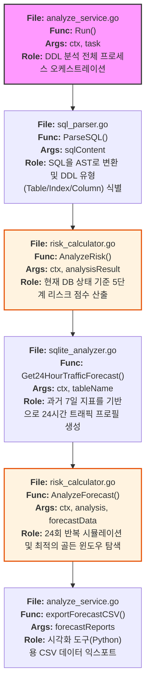
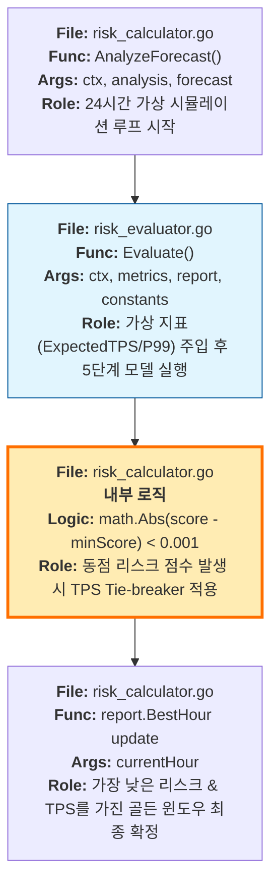
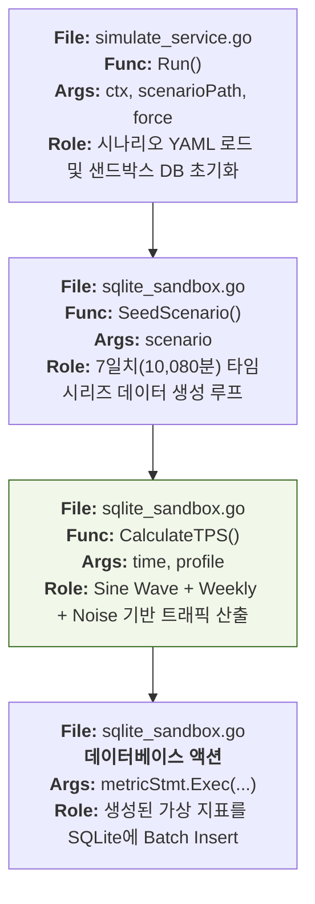

# Level 4: 함수 단위 마이크로 플로우 (Micro-Flows)

이 다이어그램은 MigraGuard의 핵심 로직을 함수 단위로 쪼개어, 각 단계가 어떤 파일의 어떤 함수에서 어떤 인자를 가지고 수행되는지 상세히 묘사합니다.

---

## 1. `analyze` 명령어 전체 실행 로직

---

## 2. 예측 엔진 및 Tie-Breaker 내부 로직

---

## 3. 샌드박스 데이터 생성 및 시딩 로직

