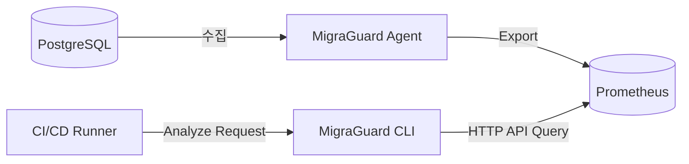

# 🏛️ 아키텍처 고도화: 향후 연구 및 개발 로드맵 (Future Roadmap)

본 문서는 MigraGuard 프로젝트의 학술 논문(Graduation Thesis) 및 캡스톤 디자인 최종 단계의 **'향후 연구(Future Work)'** 섹션 작성을 위해 구성된 기술 로드맵 문서입니다. 현재 v3.8 프로토타입의 실무적 한계를 극복하고 엔터프라이즈 DevSecOps 환경에 완전하게 통합하기 위한 4대 고도화 계획을 정의합니다.

---

## 1. 🌐 로드맵 1: 망 분리 환경 대응을 위한 TSDB 연동 및 HTTP API 아키텍처 전환

### 1.1. 현재 구조의 문제점
- 현 에이전트([agent_service.go](file:///home/gyeongho/Github/MigraGuard/cmd/migraguard/agent_service.go)) 구조는 수집된 트래픽 이력을 로컬 SQLite 파일에 저장합니다.
- 이는 가상 컨테이너나 원격 러너 환경에서 동작하는 CI/CD 배포 파이프라인이 로컬 파일 시스템에 물리적으로 접근할 수 없다는 망 분리(Network Segregation) 및 배포 장벽을 야기합니다.

### 1.2. 향후 개선 방안
- **Prometheus 및 OpenTelemetry 연동**: 에이전트가 독자적인 DB를 구축하는 대신, 업계 표준 시계열 데이터베이스(Prometheus, InfluxDB 등)로 메트릭을 PUSH하도록 변경합니다.
- **분석기(Analyze CLI)의 HTTP API화**: CLI 엔진이 SQLite 파일 주소를 플래그로 받는 대신, 원격 모니터링 서버의 HTTP API 엔드포인트를 호출하여 최근 24시간의 TPS 및 P99 지연 시간 추이를 수집하도록 아키텍처를 추상화합니다.

---

## 2. 🤖 로드맵 2: 머신러닝 기반 리스크 모델 가중치 자동 보정 (Calibration)

### 2.1. 현재 구조의 문제점
- 리스크 스코어 및 소요 시간 계산 로직([risk_evaluator.go](file:///home/gyeongho/Github/MigraGuard/pkg/migraguard/internal/analyzer/risk_evaluator.go))에 적용된 디스크 성능, 대기열 서비스율 등의 가중치는 정적으로 선언된 고정 상수(Magic Number)에 의존하고 있어, 실제 복잡한 하드웨어 환경의 비선형적인 성능 특징을 정밀하게 예측하기 어렵습니다.

### 2.2. 향후 개선 방안
- **쿼리 통계 데이터 학습 파이프라인**: PostgreSQL 내부 통계 뷰(`pg_stat_statements`) 및 OS 레벨 성능 로그를 지속적으로 수집하여 실제 DDL 소요 시간과 트래픽 간의 상관관계를 통계적 회귀(Regression) 모델 또는 경량 머신러닝 모델(XGBoost 등)로 학습시킵니다.
- **적응형 임계값 자동 추출**: 인프라의 동적 성능 한계 수치($\mu_{max}$, $DiskIO$)를 수동 입력받지 않고, 시스템이 평시 워크로드 데이터를 학습하여 최적의 임계값과 가중치를 알아서 보정하는 적응형 추천 엔진(`feat/adaptive-recommendation`)을 완성합니다.

---

## 3. 🛠️ 로드맵 3: 우회 마이그레이션(Online Schema Change) 자동 처방 연동

### 3.1. 현재 구조의 문제점
- 위험도 검사 결과 위험 수준이 'Danger'인 DDL에 대해 단순 배포 중단 및 배포 시간 변경(Golden Window)만을 제안하여, 개발 프로세스의 속도를 저하시키는 블로커로 작동할 수 있습니다.

### 3.2. 향후 개선 방안
- **우회 가이드라인 및 명령어 자동 생성**: 단순 차단을 넘어, 데이터베이스의 크기와 현재 락 수준을 분석하여 현업 표준 무중단 스키마 마이그레이션 도구(`gh-ost`, `pt-online-schema-change`)의 실행 스크립트를 자동 생성하는 처방전(Prescription) 엔진을 도입합니다.
- **적응형 스로틀링(Throttling) 제안**: 대상 PostgreSQL의 실시간 복제 지연(Replication Lag) 상태에 따라 온라인 배포 도구의 동적 제어 매개변수(예: `--max-lag-s=2`)를 자동으로 계산하여 제안합니다.

---

## 4. 🔒 로드맵 4: 프로덕션 환경 안전성 보장을 위한 최소 권한 및 보안 감사 체계

### 4.1. 현재 구조의 문제점
- 에이전트가 운영계 DB에 접근하기 위한 계정 권한 범위가 모호하며, 에이전트의 내부 데이터 스캔 행위에 대한 자체 감사 이력(Audit Trail)이 명세되어 있지 않아 엔터프라이즈 보안 심의 통과가 어렵습니다.

### 4.2. 향후 개선 방안
- **최소 권한 가이드라인 구축**: 실제 서비스 테이블 데이터(DML/DCL)에는 전혀 접근하지 못하고, 오직 메트릭 관련 스키마(`pg_catalog`, `pg_stat_statements`)만 조회할 수 있는 최소 권한의 Read-Only DB Role 템플릿을 배포 스펙에 공식 포함합니다.
- **에이전트 감사 로깅**: 에이전트가 실행하는 모든 성능 쿼리와 스캔 범위를 자체 Audit 로그로 남겨, 모니터링 활동 중 의도치 않은 잠금이나 리소스 고갈 유발 행위를 감시할 수 있도록 보완합니다.
