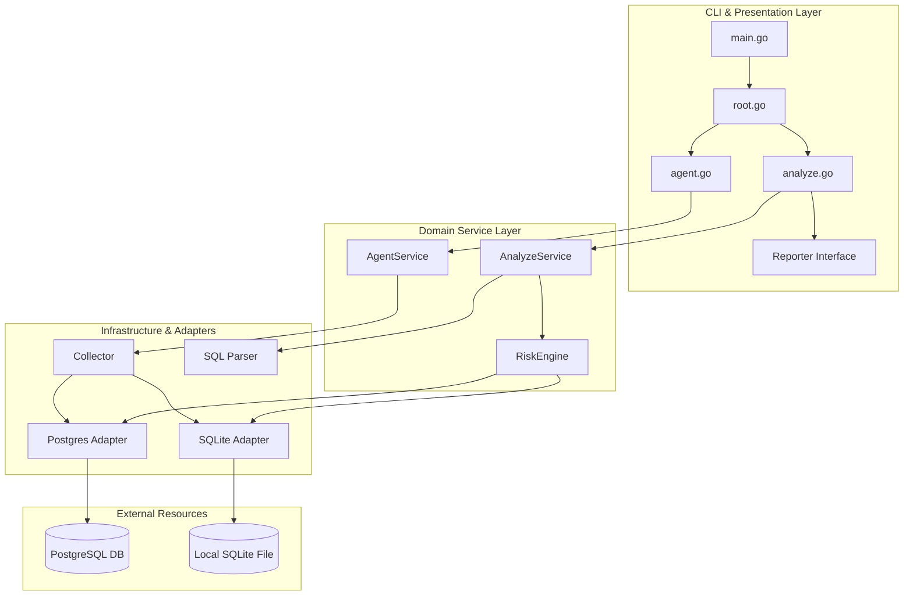
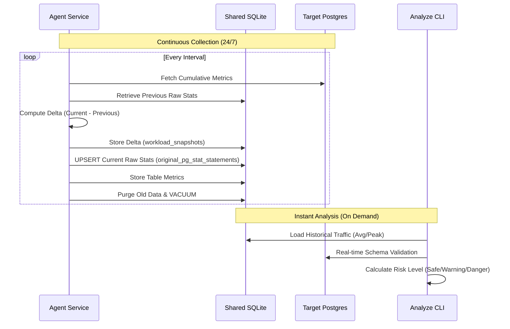

# 🏛️ MigraGuard v3.2 Technology Architecture (Finalized)

## 1. Dual-Process Architecture

MigraGuard consists of two separate processes to ensure continuous data collection and immediate analysis.

### 1.1. MigraGuard Agent (Background Service)
- **Role:** Continuously collects metrics from the target database to maintain the time-series repository.
- **Action:**
  - Periodically polls `pg_stat_statements` and `pg_stat_user_tables`.
  - **Delta Computation:** Transforms cumulative Postgres metrics into incremental "Delta" values (Current - Previous) to reflect actual load per interval.
  - **Persistent Raw Storage:** Maintains the latest raw cumulative values in the `original_pg_stat_statements` table to ensure delta continuity across agent restarts.
  - Persists computed deltas in a shared SQLite `workload_snapshots` table.
  - **Data Retention:** Automatically purges records older than the configured period (e.g., 7 days) and optimizes space using `VACUUM`.
- **Deployment:** Runs as a permanent Docker container alongside the target database.

### 1.2. MigraGuard Analyze CLI (Foreground Tool)
- **Role:** Evaluates migration SQL files and calculates risk levels instantly.
- **Action:**
  - Accesses the shared `migraguard.db` file directly via a Docker Volume.
  - Identifies target tables via AST parsing and retrieves recent (1h avg) and historical (24h peak) TPS data.
  - **Schema Validation:** Verifies the validity of the DDL against the actual database schema.
- **Deployment:** Executed by CI/CD pipelines or developers locally.

## 2. Dockerized Infrastructure & Volume Strategy

| Component | Description | Note |
| :--- | :--- | :--- |
| **PostgreSQL** | Target production database. | Requires `pg_stat_statements` |
| **SQLite (Shared)** | Shared storage for metrics. | Shared via Docker Volume (`/app/data`) |
| **Persistence** | Ensures data persists across container restarts. | Defined in `docker-compose.yml` |

## 3. Advanced 5-Step Risk Model

v3.2 implements a sophisticated 5-step analysis model:

1. **Step 1: $T_{ddl}$ (Schema Analysis):** Static analysis of DDL type and table structure.
2. **Step 2: $T_{block}$ (Lock Contention):** Estimating potential lock duration based on operation type and table size.
3. **Step 3: $C_{peak}$ (Peak Concurrency):** Analyzing peak concurrency and traffic load from the 24h historical window.
4. **Step 4: $T_{rec}$ (Table Size/Recovery):** Assessing rollback/recovery costs based on record count and table size.
5. **Step 5: Risk Score ($\lambda_{final}$):** Applying final weights to derive the risk score.
   - $\lambda_{final} = \max(\lambda_{curr}, \lambda_{avg\_1h} \times 1.2, \lambda_{peak\_24h} \times 0.8)$

---

## 4. Architecture Diagrams

### 4.1. Global Architecture Layers

### 4.2. Dual-Process Flow

