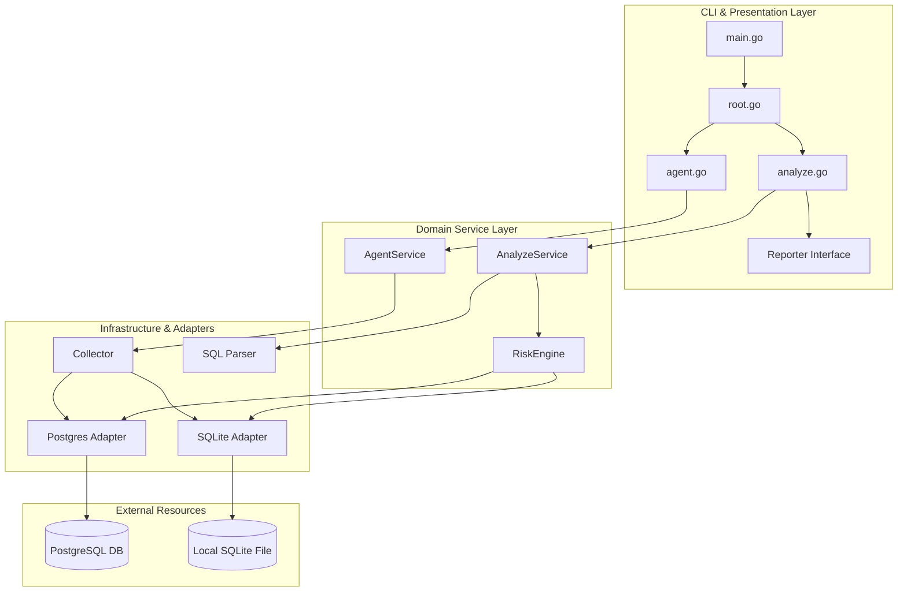
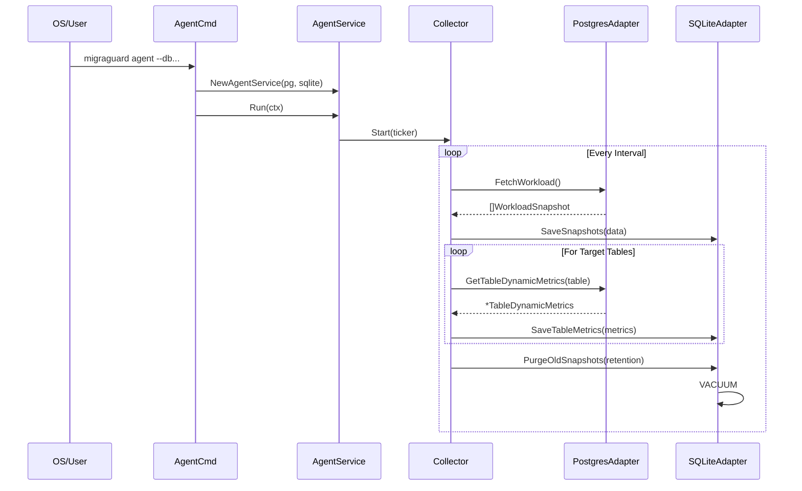
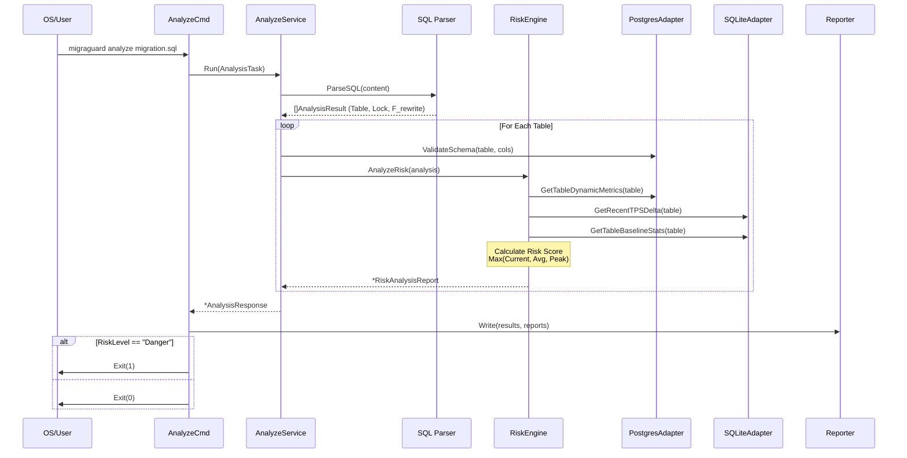
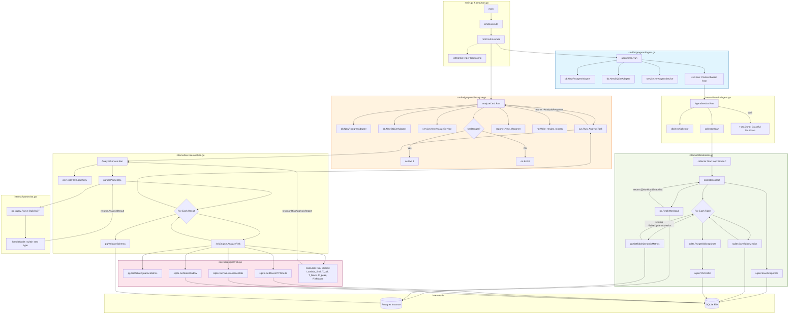

# 📊 MigraGuard v3.2 아키텍처 및 로직 다이어그램

본 문서는 MigraGuard의 서비스 흐름을 시각화하기 위한 Mermaid 다이어그램 코드를 담고 있습니다.

## 1. 전체 레이어 구조 (Architecture Layers)

---

## 2. Agent 모드 수집 흐름 (Agent Collection Flow)

---

## 3. Analyze 모드 분석 흐름 (Analyze Risk Flow)

---

## 5. 초정밀 함수 호출 그래프 (Function-Level Call Graph)

본 다이어그램은 MigraGuard v3.2의 모든 Go 파일 내 주요 함수들 간의 호출 관계(Caller -> Callee)를 상세히 보여줍니다.

